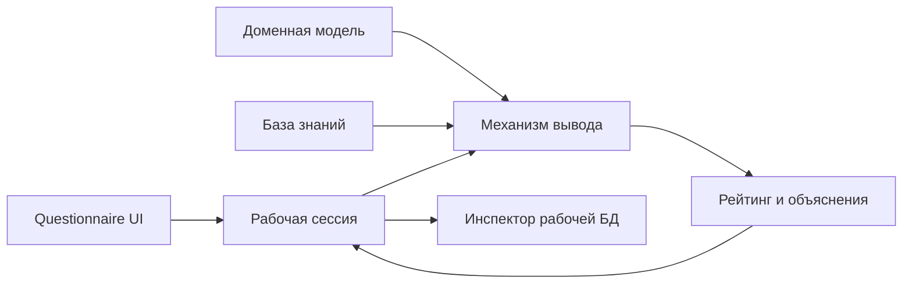

# Архитектурный каркас проекта 1

## Граница системы

Экспертная система Homescapes работает полностью в браузере. Приложение не использует backend, серверную базу данных, cookies или секретные ключи. Ответы пользователя, рабочие факты, промежуточные оценки и рейтинг существуют только в памяти открытой вкладки и сбрасываются после перезагрузки страницы.

Это ограничение соответствует GitHub Pages: Vite собирает статические HTML, CSS и JavaScript, а вся логика выполняется на клиенте. `HashRouter` позволяет открывать SPA на GitHub Pages без серверного fallback.

## Поток данных



Доменный слой не импортирует React и CSS. Поэтому модель, правила, состояние сессии и механизм вывода можно проверять обычными Node.js-тестами без браузера.

## Размещение по FSD

| Слой | Ответственность проекта 1 | Текущее место |
| --- | --- | --- |
| `app` | запуск SPA, глобальные стили, маршрутизация | `src/app`, `src/main.jsx` |
| `pages` | композиция каталога и модального окна | `src/pages/home` |
| `widgets` | крупные самостоятельные блоки проекта | `src/widgets/project-detail`, `src/widgets/app-shell` |
| `features` | пользовательский сценарий заполнения анкеты и экран результатов | `src/features/expert-system-questionnaire`, `src/features/expert-system-result` |
| `entities` | модель экспертной системы и её публичный API | `src/entities/expert-system` |
| `shared` | переиспользуемая инфраструктура и UI без бизнес-правил | `src/shared` |

Зависимости направляются сверху вниз. Доменная логика находится в `entities/expert-system/model` и не зависит от `features`, `widgets`, `pages` или `app`. React-компоненты могут вызывать доменный API, но домен не знает о компонентах.

## Модули доменной логики

| Модуль | Назначение |
| --- | --- |
| `domain.js` | параметры пользователя, свойства и 20 стратегий |
| `knowledgeBase.js` | факты уровня и декларативные правила |
| `session.js` | рабочая база данных и её переходы состояний |
| `inference.js` | нормализация, применение правил и ранжирование |
| `index.js` | публичный API сущности |

JSX и оформление не должны появляться в `entities/expert-system/model`.

Результат остаётся в feature-слое: `InferenceResultPanel` получает готовый `runInference()`-результат и отвечает только за раскрытие рейтинга, объяснений и исходных ответов.

## Соглашение об идентификаторах

Идентификаторы стабильны: переименование подписи на русском языке не должно менять ссылки между объектами.

| Объект | Формат | Пример |
| --- | --- | --- |
| вопрос | `kebab-case` | `remaining-moves` |
| правило | `kebab-case` | `few-moves-dense-obstacles` |
| стратегия | `kebab-case` | `bomb-rocket-combo` |
| параметр пользователя | `lowerCamelCase` | `remainingMoves` |
| факт уровня | `lowerCamelCase` | `obstacleDensity` |
| свойство стратегии | `lowerCamelCase` | `successProbability` |
| значение перечисления | lowercase или `kebab-case` | `beginner`, `situational` |

ID уникален внутри своего пространства имён. Вопрос ссылается на параметр или факт через `target`, а эффект правила — на стратегию через `strategyId`. Ссылочная целостность проверяется валидаторами и smoke-тестом.

## Команды разработки

```bash
npm run dev
npm test
npm run build
npm run preview
```

- `npm run dev` запускает локальный Vite-сервер.
- `npm test` проверяет доменную модель, базу знаний, анкету, ID и границу React/домен.
- `npm run build` создаёт production-сборку в `dist`.
- `npm run preview` локально раздаёт содержимое `dist`.

Рекомендуемая версия среды — Node.js 22 LTS или новее.

## Принятые ограничения

- состояние пока не переживает перезагрузку страницы;
- данные не отправляются наружу и не синхронизируются между устройствами;
- публикация выполняется отдельным workflow и не является частью доменной логики;
- постоянное хранение можно добавить позже через версионированный `localStorage`, не меняя формат доменной модели.
