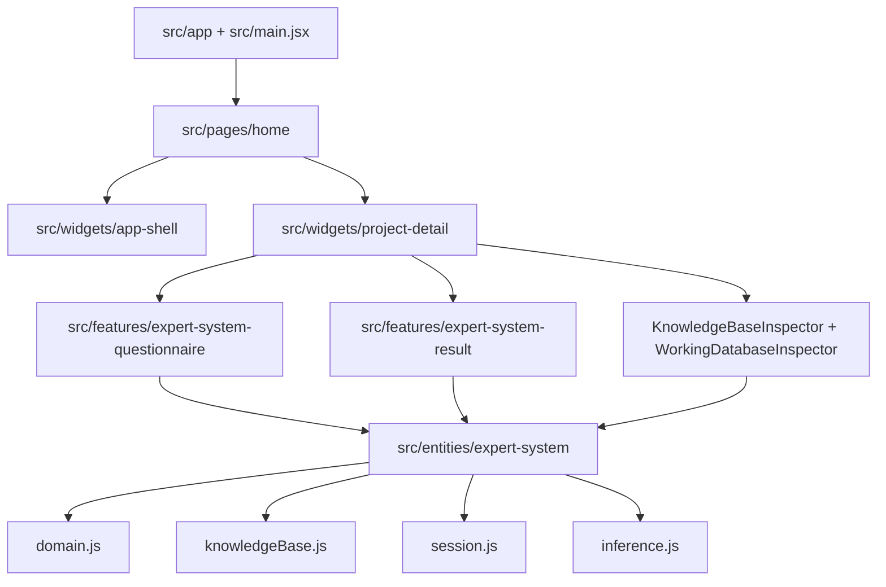
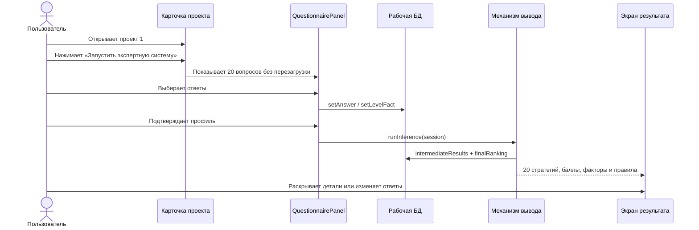

# Проект 1 — реализация и демонстрация

## Архитектура модулей



`entities/expert-system` не импортирует React. UI-слои получают снимки состояния и вызывают публичные операции доменной модели.

## Сквозной сценарий



## Формат базы знаний

База знаний возвращается `getKnowledgeBase()` и имеет четыре основных коллекции:

```js
{
  parameters: userParameters, // 12 параметров игрока
  levelFacts: levelFacts,     // 8 характеристик поля
  attributes: strategyAttributes, // 11 свойств стратегии
  strategies: strategies,     // 20 объектов ранжирования
  rules: knowledgeRules       // 12 декларативных правил
}
```

Правило имеет вид:

```js
{
  id: 'few-moves-dense-obstacles',
  mode: 'all',
  priority: 0.95,
  conditions: [{ fact, operator, value, label }],
  effects: [{ strategyId, type: 'bonus' | 'penalty', value, reason }]
}
```

`validateKnowledgeBase()` проверяет количество объектов, уникальность идентификаторов, диапазоны приоритетов и ссылки эффектов на существующие стратегии.

## Формат рабочей БД

Сессия создаётся через `createWorkingDatabase()`:

```js
{
  version: '1.0.0',
  status: 'idle' | 'collecting' | 'analyzing' | 'ranked',
  answers: {},
  levelFacts: {},
  intermediateResults: [],
  finalRanking: [],
  lastUpdatedAt: null
}
```

Состояние не сохраняется между перезагрузками. Это осознанное ограничение клиентского учебного прототипа: база знаний постоянна в коде, рабочая БД живёт только в открытой сессии.

## Формула ранжирования

Для каждой стратегии вычисляются нормализованные совпадения `matchᵢ` со значениями от `0` до `1`. Затем применяется взвешенная сумма:

```text
baseScore = Σ((matchᵢ × weightᵢ) / Σweightᵢ) × 100
ruleAdjustment = Σ(effect.value × rule.priority × 100)
score = clamp(baseScore + ruleAdjustment, 0, 100)
```

После расчёта стратегии сортируются по `score` по убыванию. При одинаковом балле используется лексикографический `strategyId`, поэтому одинаковые входные данные дают одинаковый порядок.

## Локальный запуск

```bash
npm install
npm run dev
```

Откройте адрес Vite, выберите карточку `PROJECT 01`, нажмите `Запустить экспертную систему`, ответьте на 20 вопросов и нажмите `Рассчитать рейтинг`.

Проверки перед изменением или публикацией:

```bash
npm test
npm run build
npm run preview
```

## Демонстрационный сценарий

Для демонстрации правил можно выбрать следующие ответы:

1. Оставшиеся ходы: `до 5 ходов`.
2. Плотность препятствий: `большая часть поля`.
3. Доступные бустеры: `1–2 бустера`.
4. Сохранение ресурсов: `важно всё сэкономить`.
5. Готовность тратить бустеры: `предпочитаю не тратить`.
6. Скорость: `важно пройти быстро`.

В результате активируются правила критического уровня, экономии ресурсов и ускоренного прохождения. В инспекторе рабочей БД появятся 20 промежуточных оценок и 20 элементов итогового рейтинга.

## GitHub Pages

Workflow находится в `.github/workflows/deploy.yml`. Он запускается при push в `main` или вручную через `workflow_dispatch`. При ручном запуске можно передать `source_branch`, чтобы собрать конкретную ветку; по умолчанию используется `main`. Workflow запускает тесты, собирает проект и публикует `dist` через GitHub Pages Actions. Перед публикацией в настройках репозитория должен быть выбран `Settings → Pages → Source: GitHub Actions`.

В рамках текущей задачи workflow не запускался на GitHub и публикация не выполнялась.
